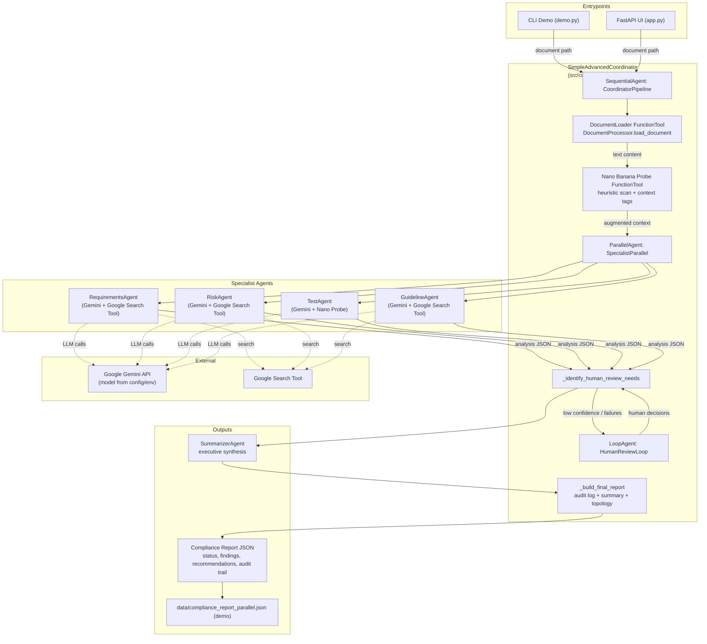

# Architecture Diagram (Mermaid)

This repo uses a Simple Advanced Coordinator built on Google ADK to fan out specialist compliance agents, loop in humans for low-confidence items, and emit a structured compliance report. The diagram below captures the runtime topology, data flow, tools, and external dependencies.

Key flow:
- User triggers via CLI or FastAPI with a document path; `DocumentProcessor` loads content and applies a lightweight nano probe for quick heuristics/context tags.
- `ParallelAgent` fans out to four Gemini-backed specialists (requirements, risk, test, guideline). Tools: Google Search where allowed; Nano Probe for test agent; Google Gemini for generation.
- Results feed `_identify_human_review_needs` to flag agent failures or low-confidence findings; `LoopAgent` waits for human decisions and rehydrates state when feedback arrives.
- `SummarizerAgent` synthesizes specialist output plus human decisions into an executive summary; `_build_final_report` adds audit trail, recommendations, and ADK topology before emitting JSON (written by demo to `data/compliance_report_parallel.json`).

State management:
- `session_state` tracks document content/path, additional context, specialist outputs, human review queue, summary, audit log, and ADK topology for transparency/telemetry.

